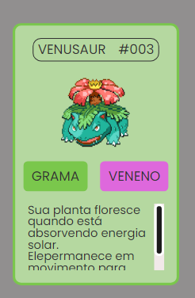
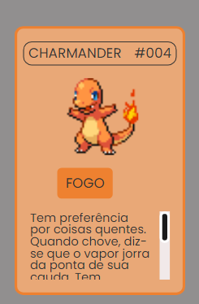
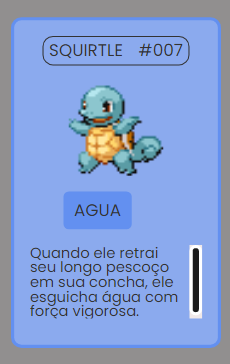

# Lista Pokémon - Semana zero ao programador contrado do Dev em dobro

Esse projeto é uma lista de Pokémons, e é um projeto que foi passado num evento do Dev em dobro, A Semana do Zero ao Programador Contratado.

| :placard: Vitrine.Dev |     |
| -------------  | --- |
| :sparkles: Nome        | **Lista Pokémon - Semana zero ao programador contrado do Dev em dobro**
| :label: Tecnologias | html, css, javascript
| :rocket: URL         | https://lista-pokemon-five.vercel.app/
| :fire: Desafio     | https://www.instagram.com/p/CsBcfrGAxKh/

<!-- Inserir imagem com a #vitrinedev ao final do link -->

## Detalhes do projeto

O projeto inicial era criar uma lista com 10 pokemons com o seus tipos e uma pequena descrição, que foi 
passado ao longo de uma semana de evento. Um projeto de um codigo bem simples.

## Mudanças do projeto original

A primeira mudança que eu fiz, foi ao invés de escrever o codigo HTML para cada card de Pokemon, eu preferi 
fazer um array separado com objetos que continham as informações dos Pokemos. E depois criei uma função no 
JavaScript que gerava os Cards na página.

E depois eu decidi mexer um pouco no CSS também, adicionando mais alguns Pokemons e mudando o estado de Hover 
dos Cards, fazendo com que cada Card tenha uma cor de acordo com o tipo do Pokemon. Abaixo alguns exemplos dos 
cards.

